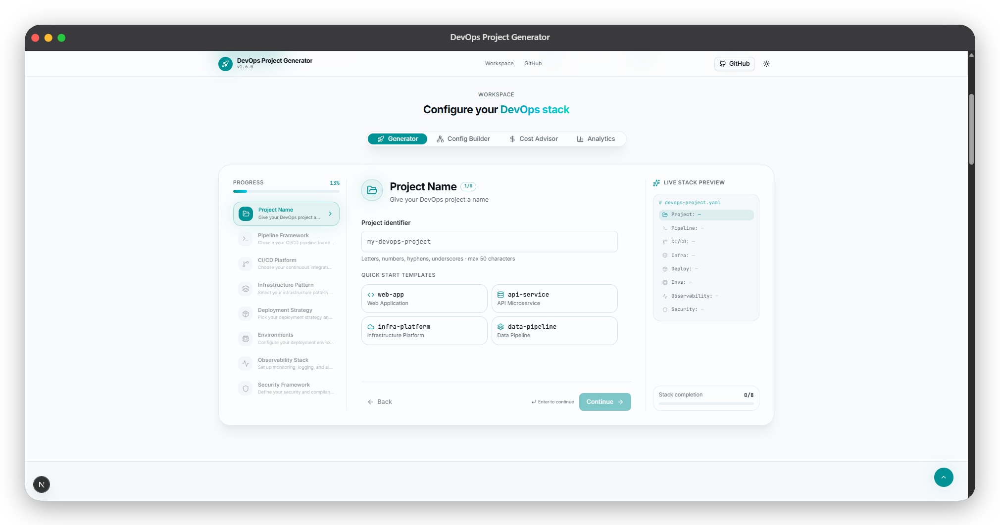

# 🚀 DevOps Project Generator 🚀

<p align="center">
  
</p>

<p align="center">
  <a href="https://pypi.org/project/devops-project-generator/"></a>
  <a href="LICENSE"></a>
  <a href="https://www.python.org/downloads/"></a>
  <a href="web-ui"></a>
</p>

A unified CLI and interactive web platform that scaffolds production-ready DevOps repositories in seconds. Configure CI/CD pipelines, Infrastructure as Code, containerized deployment strategies, observability stacks, and security compliance frameworks with zero guesswork.

---

## ⚡ Key Capabilities

- **Opinionated, Production-Ready Scaffolding**: Industry-standard directory structures, multi-stage Dockerfiles, Terraform modules, and secure CI/CD workflows.
- **DevContainer & Local Sandbox Generator**: Pre-configured `.devcontainer/devcontainer.json` and Dockerfile tailored to your runtime and selected DevOps CLIs (Terraform, Kubectl, Helm, Cloud, Trivy) with VS Code and Cursor extensions.
- **Direct GitHub Repository Scaffolder**: Push repositories directly to your GitHub account from the browser or execute single-command `gh repo create` scripts.
- **Compliance & Security Scorecard**: Live governance gauge assessing CIS Kubernetes Benchmark, SOC 2 Type II, NIST 800-53, HIPAA, and SLSA Level 3 with interactive controls (Cosign signing, Syft SBOM, Gitleaks, RBAC) and audit export.
- **Interactive Web Studio & CLI**: Run seamlessly as a terminal command or launch a responsive, editorial browser-based workspace.
- **In-Browser Code & Manifest Explorer**: Inspect syntactically realistic generated manifests (`.github/workflows`, `main.tf`, `deployment.yaml`, `Dockerfile`, `trivy-scan.yaml`, `prometheus.yml`) with line numbers, instant copy, and single-file downloads before generating.
- **Live Architecture Diagram & ADR Exporter**: Generate vector SVG pipeline topologies, export GitHub-ready Mermaid.js flowchart syntax, and download formal `ADR-001` Architecture Decision Records with zero heavy graph bundle bloat.
- **Advanced Configuration Analysis**: Visualize dependency relationships, detect conflicting options automatically, and calculate stack complexity scores (0–100).
- **Cloud Cost Optimization Advisor**: Estimate monthly infrastructure spend and unlock actionable recommendations for up to 70% in savings.
- **Privacy-First Analytics Dashboard**: Track local project generation history, technology distributions, and stack trends stored entirely in the browser.
- **Minimalist Monochrome Interface**: Engineered with an architectural editorial design system (Playfair Display + Source Serif 4 + JetBrains Mono, sharp 0px corners, high contrast) and optimized for mobile, tablet, and desktop.

---

## 🖥️ Web UI Studio (v2.0.0)

The Web UI (`/web-ui`) features a comprehensive 6-in-1 DevOps architecture workspace:

| Tool | Description |
|------|-------------|
| **01. Generator** | Interactive guided wizard with DevContainer sandbox generation, ZIP download, and Direct GitHub push. |
| **02. Config Builder** | Component dependency graph, automated conflict detection, and real-time stack complexity scoring. |
| **03. Cost Advisor** | Categorized monthly cloud spend estimation (Infrastructure, Observability, CI/CD, Security) with cost-reduction levers. |
| **04. Analytics** | Real-time statistics, most popular stack combinations, and runtime distributions (stored 100% locally). |
| **05. Architecture Diagram** | Live vector topology canvas, GitHub/GitLab Mermaid.js diagram generator, and downloadable `ADR-001` markdown file. |
| **06. Security Scorecard** | Real-time compliance audit gauge (CIS, SOC 2, NIST, HIPAA, SLSA Level 3) with dynamic supply chain controls and report download. |
| **Code & Manifest Viewer** | Split-pane file browser with category filter chips (`CI/CD`, `Terraform`, `Deploy & K8s`, `Monitoring`, `DevContainer`) and line-numbered code viewer. |
| **GitHub Scaffolder** | One-click browser GitHub API push or instant terminal CLI one-liner generator. |

---

## 🚀 Quick Start

### 1. CLI Usage

Install from PyPI:
```bash
pip install devops-project-generator
```

Initialize a new project:
```bash
# Interactive mode (with DevContainer & Git options)
devops-project-generator init

# Direct flag-based generation with DevContainer sandbox & Git init
devops-project-generator init \
  --name my-production-stack \
  --ci github-actions \
  --infra terraform \
  --deploy kubernetes \
  --envs dev,stage,prod \
  --observability full \
  --security strict \
  --devcontainer \
  --git-init

# Security & Compliance Audit (CIS, SOC 2, NIST, HIPAA, SLSA)
devops-project-generator audit ./my-production-stack

# Mermaid Architecture Topology & ADR-001 Generator
devops-project-generator diagram ./my-production-stack --adr

# One-step GitHub Repository Scaffolder
devops-project-generator github ./my-production-stack
```

### 2. Web UI Studio

Launch the local studio interface:
```bash
git clone https://github.com/NotHarshhaa/devops-project-generator.git
cd devops-project-generator/web-ui
npm install
npm run dev
```

Open [http://localhost:3000](http://localhost:3000) in your browser.

---

## ⚙️ Supported Technology Matrix

| Domain | Supported Options |
|--------|-------------------|
| **CI/CD Pipelines** | GitHub Actions, GitLab CI, Jenkins, None |
| **Infrastructure as Code** | Terraform (AWS/GCP/Azure/DO), AWS CloudFormation, Ansible, None |
| **Deployment & Containers** | Kubernetes, Docker / Docker Compose, Virtual Machines (VM) |
| **Environments** | Single Environment, Multi-Environment (`dev`, `stage`, `prod`) |
| **Observability** | Basic Logging, Logs + Metrics (Prometheus/Grafana), Full Stack (Prometheus, Grafana, ELK, Tracing) |
| **Security & Compliance** | Basic (linting/hygiene), Standard (Trivy scans, non-root users), Strict (CIS Benchmarks, RBAC, Network Policies) |

---

## 🏗️ Generated Project Layout

```
devops-project/
├── .github/workflows/   # CI/CD pipeline automation (build, test, scan, deploy)
├── infrastructure/      # Terraform modules, variables, and cloud provider configs
├── deployments/         # Kubernetes manifests, Helm charts, or Docker Compose
├── monitoring/          # Prometheus metrics scrapers, Grafana dashboards, alerting
├── security/            # Trivy vulnerability scanner configs, network policies, RBAC
├── scripts/             # Local development setup and deployment automation
├── config/              # Environment-specific configuration overrides
└── docs/                # Architecture documentation, runbooks, and ADR-001 record
```

---

## 📚 Documentation & Guides

- 📖 **[Commands Reference](COMMANDS.md)** — Complete CLI flag catalog and syntax options.
- 🎯 **[Usage Examples](EXAMPLES.md)** — Practical stack configurations for microservices, web apps, and enterprise platforms.
- 🗂️ **[Templates Guide](TEMPLATES.md)** — In-depth breakdown of templates and variable substitution.
- 📝 **[Changelog](CHANGELOG.md)** — Release notes and version history.
- 🤝 **[Contributing Guide](CONTRIBUTING.md)** — How to contribute templates, report bugs, and submit pull requests.

---

## 🤝 Contributing

Contributions are always welcome! Whether you are adding a new pipeline template, refining an infrastructure pattern, or improving documentation:

1. Fork the repository
2. Create your branch (`git checkout -b feature/new-template`)
3. Commit your changes (`git commit -m "feat: add argo-cd deployment pattern"`)
4. Push to the branch (`git push origin feature/new-template`)
5. Open a Pull Request

Please review our **[Contributing Guide](CONTRIBUTING.md)** for details on testing and formatting standards.

---

## 📄 License

This project is licensed under the MIT License — see the [LICENSE](LICENSE) file for details.

---

## 📞 Author & Community

Crafted with care by **[Harshhaa Vardhan Reddy](https://github.com/NotHarshhaa)**.

- 🔗 **GitHub**: [@NotHarshhaa](https://github.com/NotHarshhaa)
- 🌐 **Portfolio**: [notharshhaa.site](https://notharshhaa.site)
- 💼 **LinkedIn**: [Harshhaa Vardhan Reddy](https://www.linkedin.com/in/NotHarshhaa/)
- 💬 **Telegram Community**: [Join ProDevOpsGuy](https://t.me/prodevopsguy)
